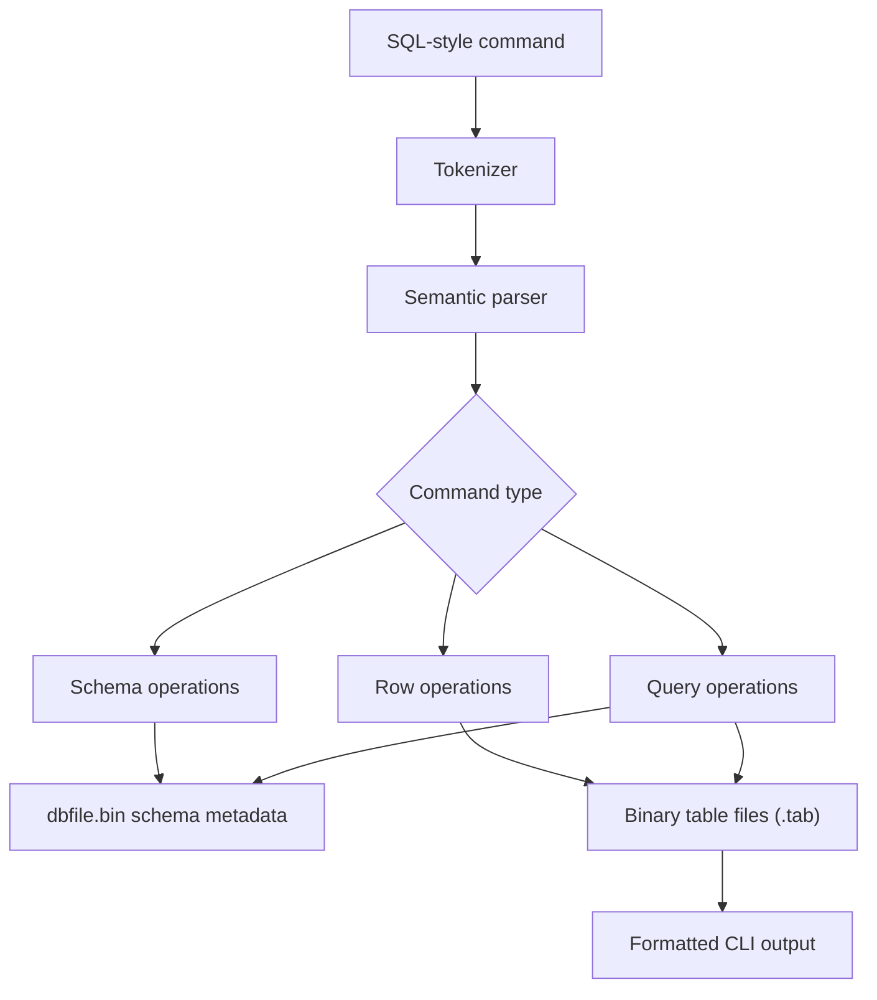

# Tiny SQL Engine

Tiny SQL Engine is a small relational database engine written in C++. It runs from the command line and supports SQL-style commands for creating tables, inserting rows, selecting data, updating values, deleting rows, joins, sorting, and aggregate queries.

The goal of this project is to understand how a database works internally without using an external database server. The engine handles command parsing, schema metadata, binary table files, row updates, logical deletes, and simple query execution directly in C++.

## Tech Stack

- **C++** for the database engine and query execution logic
- **Binary file storage** for schemas and table rows
- **C++ compiler** such as `g++` or `clang++`
- **GDB** for debugging storage and parsing behavior
- **Docker** for an optional reproducible Linux build environment
- **Git / GitHub** for version control

## Features

- Create and drop tables
- Insert, select, update, and delete records
- List tables and inspect table schemas
- Store table rows in binary `.tab` files
- Keep schema metadata in a central database file
- Reuse deleted row slots during inserts
- Filter records with `WHERE`, `AND`, and `OR`
- Sort results with `ORDER BY`
- Run natural joins with `ON` conditions
- Run aggregate queries with `COUNT`, `SUM`, and `AVG`

## Workflow



## Storage Model

Tiny SQL Engine separates metadata from table data:

- `dbfile.bin` stores table definitions and column metadata.
- Each table gets its own binary `.tab` file.
- Rows include a delete flag, so deleted rows can be skipped during reads.
- New inserts can reuse deleted slots instead of always growing the file.

This keeps the implementation simple while still showing real database ideas like schema lookup, row layout, file offsets, and logical deletion.

## Build

Compile with a C++ compiler:

```bash
g++ -std=c++17 -g -o tinydb db.cpp
```

You can also use `clang++`:

```bash
clang++ -std=c++17 -g -o tinydb db.cpp
```

## Usage

Create a table:

```bash
./tinydb "create table employee (id char(10) NOT NULL, name char(20), team char(20))"
```

Insert a row:

```bash
./tinydb "insert into employee values (1, Maya, Platform)"
```

Query rows:

```bash
./tinydb "select * from employee"
```

Update a row:

```bash
./tinydb "update employee set team = Core where id = 1"
```

Delete a row:

```bash
./tinydb "delete from employee where id = 1"
```

## Project Structure

```text
tiny-sql-engine/
├── db.cpp
├── db.h
├── sample_commands.txt
├── .clang-format
├── .gitignore
└── README.md
```

## Notes

This is an educational database engine, not a production database. It is meant to make database internals easier to understand by implementing the core pieces directly in C++.

## Implementation Notes

- Table data is intentionally stored in binary files so row layout, offsets, and update behavior stay visible in the code.
- Deleted rows are marked and reused instead of immediately compacting files, which keeps writes simple and predictable.
- Query support is scoped to a learning engine: the focus is storage, parsing, and execution flow rather than SQL completeness.
- Generated files such as `dbfile.bin`, `.tab` tables, and compiled binaries should stay out of version control.
